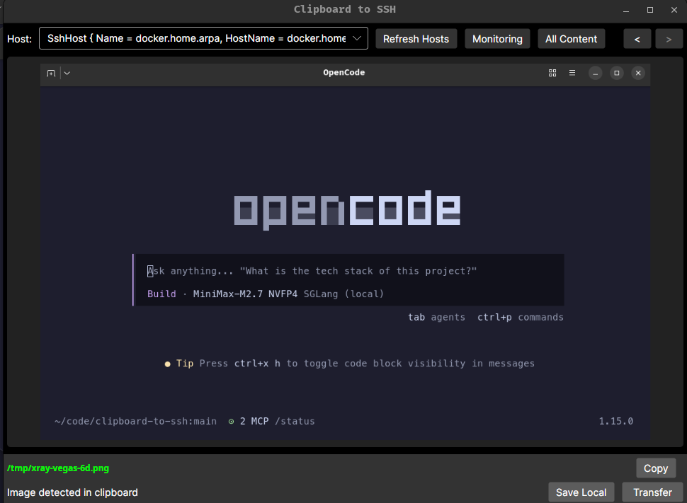

# Clipboard-to-SSH

A cross-platform desktop app that monitors your clipboard and lets you quickly transfer clipboard contents (images or text) to a remote server via SFTP.

## Use Case

When using LLM agents via SSH from a Windows workstation, clipboard operations (copy/paste) don't work over SSH. This tool solves that by:

1. Copy an image or text to your clipboard locally
2. Select a remote host from your SSH config
3. Transfer the content to `/tmp/` on that host with an easy-to-type filename
4. Tell your LLM to analyze the file

## Features

- **Clipboard monitoring** - Detects text and images in your clipboard (250ms polling)
- **SSH config integration** - Automatically loads hosts from `~/.ssh/config`
- **SFTP transfer** - Upload to remote `/tmp/` with human-readable filenames
- **Word-based filenames** - Easy to type and communicate verbally (e.g., `pepper-ivory-7f.png`)
- **Local save** - Also save clipboard content to local `/tmp/`
- **Pause/Resume** - Toggle clipboard monitoring for sensitive content
- **Image-only mode** - Only react to image clipboard content
- **Clipboard history navigation** - Navigate forward/backwards through your clipboard history with keyboard shortcuts (Ctrl+Left/Right)
- **Dark theme** - Easy on the eyes

## Screenshot



## Requirements

- .NET 10 SDK (or .NET 8+)
- Linux, Windows, or macOS
- SSH keys or password authentication configured for your remote hosts

## Building

```bash
cd src
dotnet build
dotnet run
```

## SSH Config

The app reads your `~/.ssh/config` file. Example:

```
Host myserver
    HostName myserver.example.com
    User admin
    Port 22
```

If no user is specified, it defaults to your current username.

## Filename Format

Files are named with a word-based scheme for easy typing:
- Images: `word1-word2-hex.png` (e.g., `pepper-ivory-7f.png`)
- Text: `word1-word2-hex.txt`

The filename is shown in the app before transfer, so you know what to reference in your SSH session.

## License

MIT
